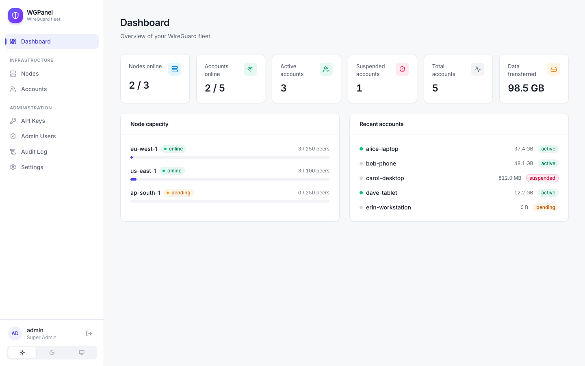
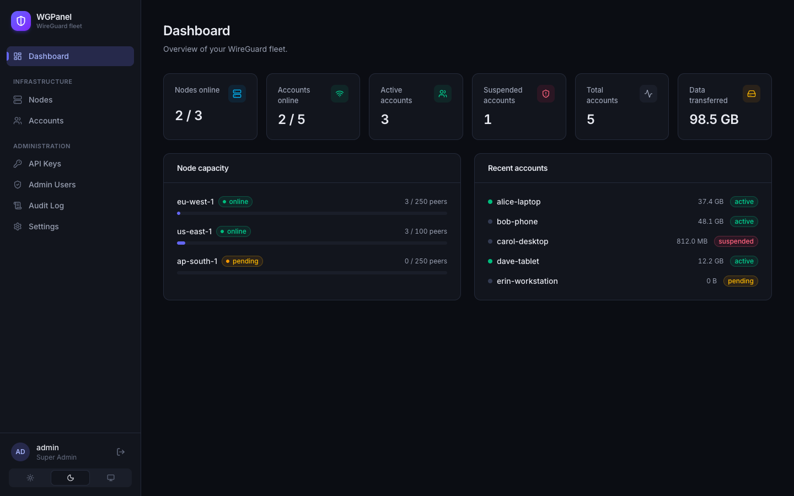
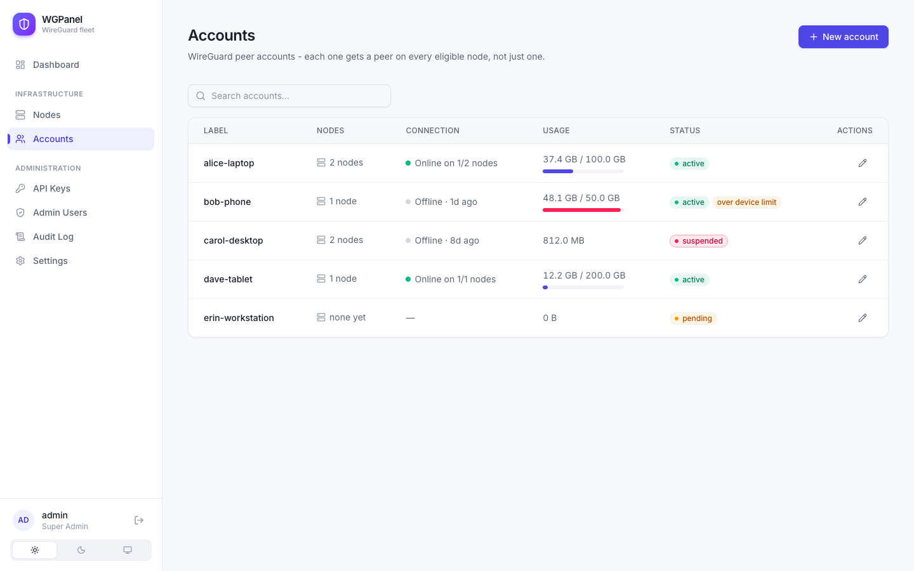
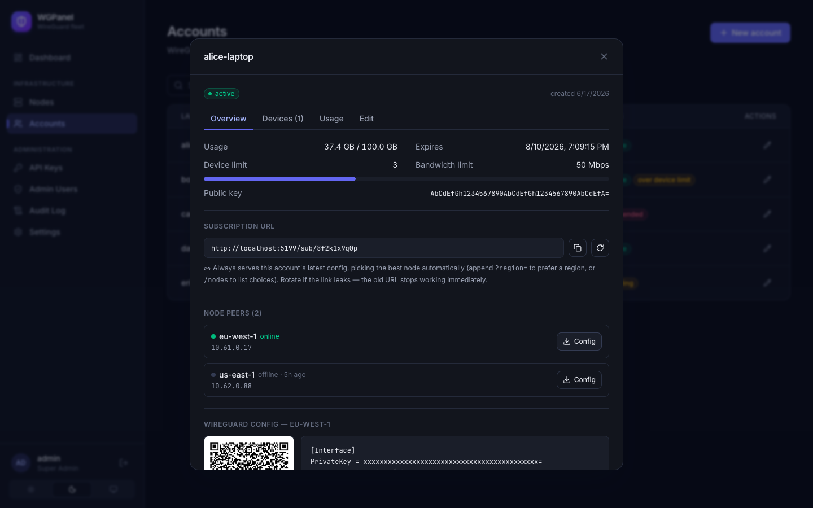
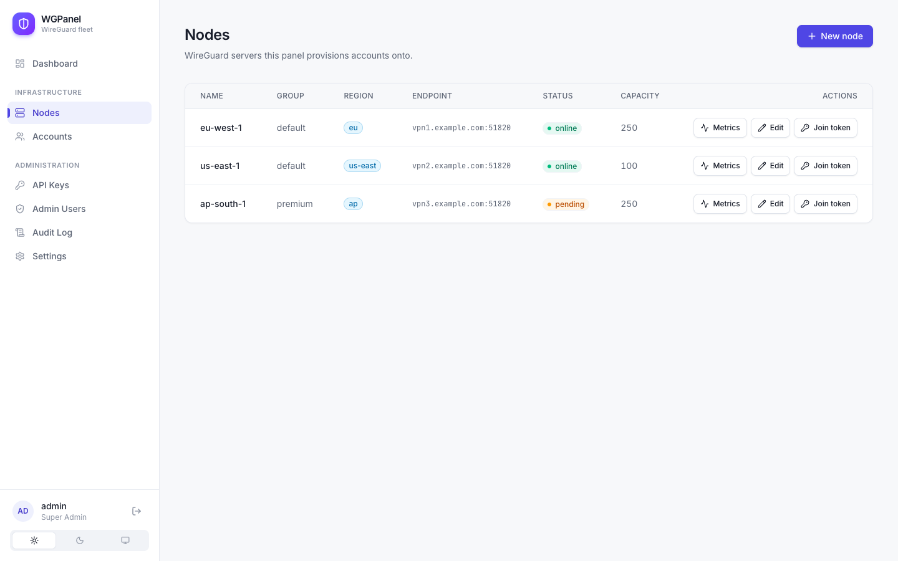
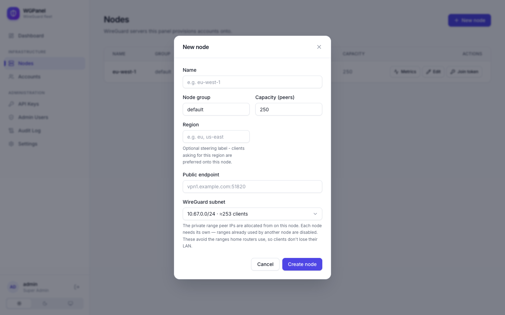
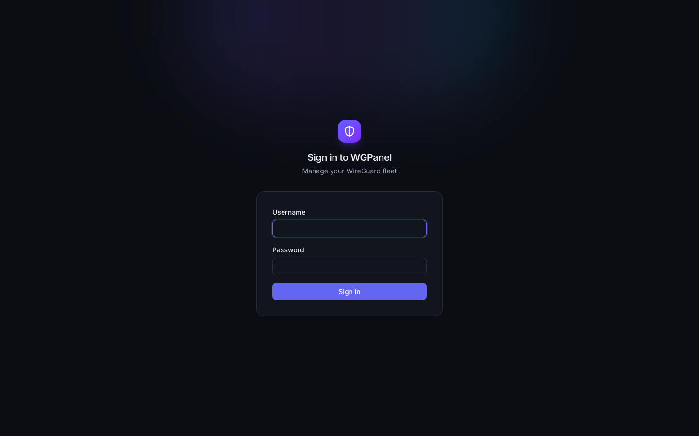

# WGPanel

WGPanel is a self-hosted admin panel for running your own WireGuard VPN service. It manages accounts (peers), servers (nodes), and gives you a real-time view of usage, connectivity, and node health — all from one web dashboard.

- **Multi-node by default** — create an account once and it's usable across every server in your fleet, not pinned to a single node.
- **Live monitoring** — per-account traffic charts, node CPU/RAM history, and online/offline status for every connection.
- **Service tiers** — per-account bandwidth limits (enforced on every node via tc), data quotas, expiry, and device limits with optional auto-suspend when a config is shared across too many devices.
- **Subscription URLs** — every account gets a stable link that always serves its latest config, picking the best node automatically (load/health/region-aware steering); rotate the link anytime without re-issuing keys.
- **Self-service domain & TLS** — change the panel's domain from the Settings page; Caddy provisions the certificate automatically, no restart needed.
- **Role-based admin accounts** — super admin, operator, and read-only support roles.
- **A scoped API** for bots/resellers to provision accounts programmatically (e.g. from a Telegram sales bot), kept completely separate from WireGuard/infrastructure logic.

## Requirements

- A Linux server (Ubuntu/Debian) with a public IP, for the panel itself.
- A domain name pointed at that server's IP, if you want automatic HTTPS.
- Docker is installed automatically by the installer if it's missing.

## Installing the panel

Run this on the server that will host the admin panel:

```bash
curl -fsSL https://raw.githubusercontent.com/iamfarhad/WGPanel/main/deploy/install.sh -o install.sh
sudo bash install.sh
```

The installer will ask for:

- **Panel domain** — must already point at this server's IP (used for automatic HTTPS via Caddy).
- **Admin e-mail** — used for Let's Encrypt certificate notices.
- **Super-admin username** — the account you'll use to log into the panel.
- Whether to also set up WireGuard **on this same server** as your first node (recommended — you can add more servers later).

When it finishes, your panel is live at `https://<your-domain>`. The auto-generated super-admin password is printed once at the end of the install — save it immediately, since it's never shown again (you can also recover it later with `wgpanel show-bootstrap-admin`, as long as the container's log history hasn't rotated it out).

> **Starting over?** Re-running `install.sh` keeps your existing `.env` and data. To wipe everything (containers, data volumes, secrets, and the self-node) and install fresh, run `sudo bash install.sh --fresh`. The panel binds high, rarely-used host ports by default (e.g. the node-agent port is `48443`, not the old `9090` that clashes with Cockpit/Prometheus); the installer also fails fast with a clear message if that port is already taken.

## Adding more WireGuard servers

Every node — including the panel's own server — is added the same way:

1. In the panel, go to **Nodes → New node** and fill in its name, capacity, and WireGuard subnet.
2. Click **Join token** to generate a one-time token.
3. On the new server, run:

   ```bash
   curl -fsSL https://raw.githubusercontent.com/iamfarhad/WGPanel/main/deploy/install-node.sh -o install-node.sh
   sudo bash install-node.sh
   ```

4. Paste in the control-plane address and the join token when prompted.

The node will appear as **online** in the panel within a few seconds, and every existing account automatically gets a peer on it — no manual sync step.

> Re-registering a node's agent (rebuilt server, replaced hardware)? Generate an **unlimited** join token instead of a normal one (checkbox in the Join token dialog) so you don't have to reset anything manually.

## Screenshots

The dashboard gives an at-a-glance view of the fleet — nodes online, accounts, data transferred, and live node capacity. Light and dark themes are both built in (switchable per-user):

| Light | Dark |
| --- | --- |
|  |  |

**Accounts** — search, per-account usage with quota bars, and live connection status:



**Account detail** — a tabbed view for overview, devices, usage charts, and inline editing (quota, device limit, bandwidth, expiry), plus the subscription URL and per-node config/QR:



**Nodes** — every WireGuard server in the fleet, with status, region, endpoint, and capacity. Adding a node offers a curated list of peer subnets (already-used ranges are disabled) so you never collide with another node or a client's home LAN:

| Nodes | New node |
| --- | --- |
|  |  |

<p align="center"></p>

## Managing the stack

The installer places a `wgpanel` CLI on the panel server:

```bash
wgpanel status               # container + API health
wgpanel logs [service]       # tail logs
wgpanel backup               # dump the database + .env to deploy/backups
wgpanel update                # backup, pull latest images, redeploy, auto-rollback on failed health check
wgpanel doctor                # disk space, container/DB/Redis health, TLS cert expiry, backup freshness
wgpanel create-admin          # add another admin account
```

Run `wgpanel` with no arguments for the full command list.

## Using the panel

- **Accounts** — create a WireGuard account, set a data quota/device limit/bandwidth limit/expiry, and download the `.conf` or scan the QR code from any device it has a peer on. Each account's detail view also shows its subscription URL and the devices recently seen using it.
- **Nodes** — see live status, edit capacity/endpoint/region, and view CPU/RAM history for each server.
- **Dashboard** — fleet-wide stats: nodes online, accounts online, active/suspended counts, total data transferred.
- **Settings** — panel defaults (quota, device limit, node capacity) and live domain/TLS management.
- **API Keys** — issue scoped, HMAC-signed keys for bots/resellers to create and manage accounts via the API.

## For developers

Architecture notes, the full API reference, and design docs for each feature area live in [`docs/`](docs) — start with [`docs/openapi.yaml`](docs/openapi.yaml) for the API surface.

### Repo layout

| Path | What it is |
| --- | --- |
| `backend/` | Go 1.25 control plane. `cmd/api` (the panel API + node-agent server) and `cmd/agent` (the WireGuard node agent). SQL migrations in `internal/store/migrations`. |
| `frontend/` | React 19 + TypeScript + Vite + Tailwind admin SPA. |
| `deploy/` | Docker Compose, Caddy, the `install.sh` / `install-node.sh` installers, and the `wgpanel` management CLI. |
| `docs/` | Product/architecture docs and `openapi.yaml`. |

### Local development

Everything runs from `deploy/` with Docker Compose. Compose auto-merges `docker-compose.yml` (production) with `docker-compose.override.yml` (dev-only) whenever you run it from this directory, so a local `up` builds the images from source and makes the in-Docker WireGuard test node available — none of which ships to production.

```bash
cd deploy
cp .env.example .env          # then set the CHANGE_ME secrets; for local use, point the
                              # image vars at local tags, e.g. API_IMAGE=wgpanel-api:local
                              # and FRONTEND_IMAGE=wgpanel-frontend:local
docker compose up -d --build  # build + start db, redis, api, frontend, caddy
docker compose logs -f api    # the one-time bootstrap admin password is printed here
```

Optionally run a WireGuard node in Docker (handy on macOS, where `install-node.sh` can't run natively). Generate a join token in the panel (**Nodes → New node → Join token**), put it in `.env` as `NODE_JOIN_TOKEN`, then:

```bash
docker compose --profile node up -d wg-node
```

**Working on the frontend alone** — Vite's dev server proxies `/api` to the backend (default `http://127.0.0.1:48080`, matching `API_PORT`; override with `VITE_BACKEND_URL`), so you get HMR against the running API stack:

```bash
cd frontend
npm ci
npm run dev        # http://localhost:5173
npm run lint       # oxlint
npm run build      # type-check (tsc -b) + production build
```

**Working on the backend alone:**

```bash
cd backend
go test ./...
go vet ./...
gofmt -l .         # must print nothing
```

There's a browser-driven smoke test that exercises the whole panel against a running stack: `node frontend/e2e-smoke.mjs` (see the file header for the env vars it takes).

### Production vs. dev Compose

- **`docker-compose.yml`** is production-only: five services (db, redis, api, frontend, caddy), pinned image digests, bounded logs, per-service memory limits, `no-new-privileges`, and healthchecks. It pulls `API_IMAGE` / `FRONTEND_IMAGE` and never builds. `install.sh` copies just this file to the server.
- **`docker-compose.override.yml`** adds the local `build:` directives and the dev `wg-node`. It lives only in the repo and is never deployed.

Per-container memory ceilings are tunable via `.env` (`DB_MEM_LIMIT`, `REDIS_MEM_LIMIT`, `API_MEM_LIMIT`, …) — see the comments in `.env.example`.

### Images & CI

Pushes to `main` build and publish three images to GHCR via `.github/workflows/build-{api,frontend,node}.yml`:

- `wgpanel-api` — the control plane (also contains the agent binary).
- `wgpanel-frontend` — the SPA served by nginx.
- `wgpanel-node` — the production WireGuard node (`deploy/node.Dockerfile`), run as a container by both installers.

Both installers deploy nodes as **production Docker containers** (bridge networking, the container NATs client traffic in its own namespace). If the published `wgpanel-node` image can't be pulled (e.g. before CI has run, or a private package), they fall back to building it from source on the host. If you fork the repo, update `API_IMAGE` / `FRONTEND_IMAGE` / `NODE_IMAGE` in `.env.example` (and make the GHCR packages public).
